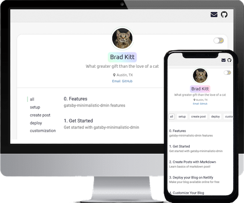
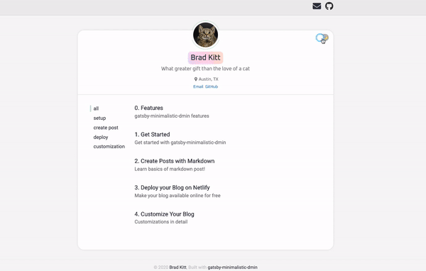
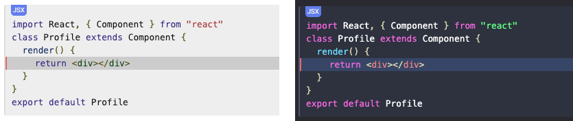

<p align="center">
  <a href="https://github.com/EllisMin/gatsby-minimalistic-dmin-netlify">
    
  </a>
</p>
<h1 align="center">
  gatsby-minimalistic-dmin
</h1>

## Description

A ready-to-use, customizable personal blog with minimalistic design

## Demo

[Demo](https://gatsby-minimalistic-dmin.netlify.com/) is available here

## Features

- Simple blog with responsive design

  

- Light / Dark Mode Switch

  

- Fast !

  - **gatsby-minimalistic-dmin** is built with [gatsbyjs](https://www.gatsbyjs.org/) that pre-builds pages that's delivered to viewers instantly

- Markdown / HTML to create post & about page

  - [Learn More](https://gatsby-minimalistic-dmin.netlify.com/2020/03/markdown-ex/)

- Prismjs code blocks (Light / Dark)

  

* Facebook Comments plugin

* Social Media Links & Share Buttons

  - Supports Email | GitHub | Facebook | Twitter | LinkedIn | Instagram | Medium

* Google Analytics

  - Google Analytics measure how users interact with your blog.

* Easy & Highly Customizable

  - Customize everything by tweaking [dmin-config.js](https://gatsby-minimalistic-dmin.netlify.com/2020/02/customize/)

## Get Started 🚀

### More detailed guide is available on [Demo site](https://gatsby-minimalistic-dmin.netlify.com/)

1.  **Download using npx | npm**

    ```bash{promptUser: root}{outputLines: 1, 3}
    # Using npx
    npx gatsby new my-blog https://github.com/EllisMin/gatsby-minimalistic-dmin
    # Using npm
    npm i -g gatsby-cli && gatsby new my-blog https://github.com/EllisMin/gatsby-minimalistic-dmin
    ```

    > If you haven't, [download npm](https://nodejs.org/en/) with Node.js

2.  **That's it! Run your blog locally**

    ```bash{promptUser: root}
    cd my-blog
    npm start
    ```

    Then, open your web browser and go to `localhost:8000`

    **Post Example**

    Create `*.md` under `_posts` directory in the root directory

    ```
    ---
    title: "First Post"
    date: 2020-02-27
    tags: [category1]
    ---

    ## First post
    This is first post
    ```

    ### Learn more about [creating post](https://gatsby-minimalistic-dmin.netlify.com/2020/03/markdown-ex)

3.  **Modify `dmin-config.js` to your needs**

    ### Learn more about [customizing config](https://gatsby-minimalistic-dmin.netlify.com/2020/02/customize/)

4.  **Deploy your Blog on Netlify 💫**

    ### Learn [how to deploy your blog online](https://gatsby-minimalistic-dmin.netlify.com/2020/03/deploy)

## Issues

[Issues](https://github.com/EllisMin/gatsby-minimalistic-dmin/issues)

## License

[MIT](https://github.com/EllisMin/gatsby-minimalistic-dmin/blob/master/LICENSE)
